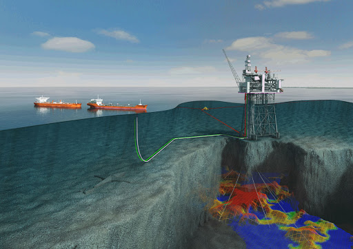

# Geologist

### Dataset description

The dataset consists of 20 different categorical and continuous parameters of 513 oil deposit.
There are 72 blanks in one categorical and one continuous parameter, which must be filled.

### Tasks

- Provide an approach to most accurately fill in missing values.
- Provide an approach to assess the reliability of parameter values (anomaly detection).
- Provide a method to generate oil deposit synthetic data.

### Why these tasks are important?

- Accurate estimation of porosity is vital for improvement of oil/gas recovery, selection of cost-effective production schemes, optimization of well placement, developing geothermal energy etc. So correct models on this stage can save huge amounts of money for a company. 
- Reservoir’s data is very rare and new data is very expensive to obtain. When we don’t have enough data, we want to generate plausible data. 
- When we have complete data, we want to know how much can we trust this data. Because mistakes in the oil industry are very expensive.

Thus it’s complete universal pipeline for preprocessing oil reservoir’s data.
